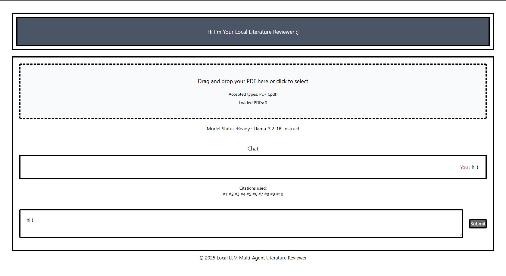

# Local LLM Multi‑Agent Literature Reviewer
Privacy‑first, fully browser‑based app to ingest research PDFs, index them in a client‑side vector store, and chat with a local LLM agent to generate a reliable, cited literature review.
(Runs entirely on the client via WebGPU (WebLLM) and Transformers.js. No cloud uploads).

## Live Demo 
Test the model now by following by clicking [here](https://lucaricotrouge.github.io/Local_LLM_Multi_Agent_Literature_Reviewer/). 

## Visuals


Replace the placeholder with a real screenshot (e.g., save to `docs/screenshot.png` and update the link).


## Overview & Goals
Build a privacy‑preserving research assistant that runs in the browser:
- Ingest PDFs (drag & drop)
- Extract text (PDF.js) and chunk it
- Create embeddings (Transformers.js) and store locally
- Search by cosine similarity and inject context into a WebLLM agent
- Generate a structured, cited **literature review**

## Key Features
- PDF ingestion and client‑side text extraction
- Configurable chunking with overlap
- Local embeddings via `Xenova/all-MiniLM-L6-v2`
- Custom vector store (global array) with cosine similarity search
- “Lit Reviewer” agent (WebLLM) with chat history
- RAG: inject top‑N relevant chunks into the prompt
- Tailwind UI: model status, chat history, and citation indicators
- Simple SPA deployment on GitHub Pages

## Tech Stack
- WebLLM
- Transformers.js
- Tailwind CSS
- Vanilla JavaScript

Additional tools used:
- PDF.js for client‑side PDF text extraction
Entry points: [index.html](index.html) and main scripts in [input.js](input.js).

## Prerequisites
- Modern browser with **WebGPU** (recent Chrome/Edge recommended)
- Network access to load model weights via CDN on first run
- Local dev server (CORS/ESM)
  - If you see `SharedArrayBuffer` issues, use a server or browser profile that enables COOP/COEP for `localhost`, or a dev server that sets appropriate headers.

## Local Setup
1) Clone the repo and switch into the project folder
2) Start a local server (e.g., Python):

```bash
python -m http.server
```

3) Open: http://localhost:8000

Alternative: VS Code Live Server or any static server.

## Usage Guide
1) Open the app and drop your PDF files onto the upload area.
2) Wait for text extraction and indexing (chunks + embeddings).
3) Ask questions in the chat. The agent retrieves relevant passages (RAG) and answers with sources.
4) Click “Generate Literature Review” to produce a structured synthesis (Introduction, Comparison, Conclusion) with citations.

## RAG Implementation Details
- Extraction: PDF.js (CDN)
- Chunking (example): 500‑char window with 100‑char overlap
- Embeddings: `Xenova/all-MiniLM-L6-v2` via Transformers.js (embeddings pipeline)
- Vector Store: array of `{ text, embedding, source }`
- Cosine similarity (pure JS):

```
similarity(A, B) = sum(A_i * B_i) / (sqrt(sum(A_i^2)) * sqrt(sum(B_i^2)))
```

- Retrieval: encode the user question → compare with all embeddings → keep top N
- Prompt: System Instruction + Chat History + Retrieved Context + User Question

## Agent Interface & Citations
- WebLLM: load a compact WebGPU‑compatible model (e.g., `Llama-3.2-1B-Instruct`)
- History: maintain a conversation array and inject it into the prompt
- Citations: UI shows which sections/documents were used (source + excerpt) for transparency

## Performance & Compatibility
- Performance depends heavily on your GPU/browser.
- Without WebGPU, CPU fallback can be slow.
- Tips: leverage caching for weights (where supported), use smaller models, reduce `top N` for retrieval.

## Roadmap
- Robust multi‑PDF handling (per‑document status, resumable)
- “Memory Bank” (chunk counts, memory usage)
- UI/UX enhancements (clickable citations, highlighted passages)

## Resources
- WebLLM: https://webllm.mlc.ai/
- Transformers.js: https://huggingface.co/docs/transformers.js/
- PDF.js: https://mozilla.github.io/pdf.js/

## Privacy
All processing happens locally in your browser. No PDF data or conversation content is sent to external services.
